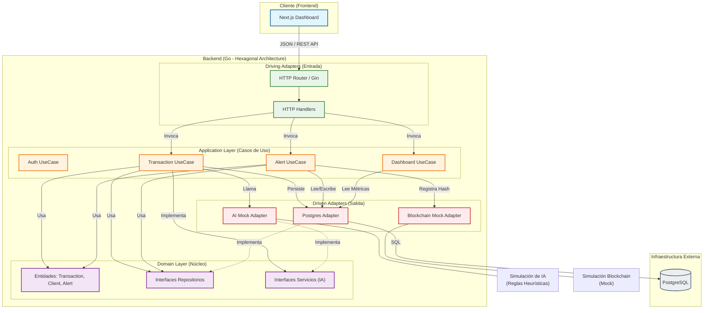

# Zentinel - Dashboard de Monitoreo de Transacciones

## Problema Elegido: Dashboard de Monitoreo de Transacciones y Alertas de Fraude

Elegí desarrollar un sistema de detección de fraude bancario porque representa un desafío técnico completo y realista. La detección de fraude es un problema crítico en la banca moderna que combina el procesamiento de datos transaccionales con la toma de decisiones inteligente.

Esta elección permite demostrar:
*   **Relevancia del dominio:** Es un problema real que requiere precisión y velocidad.
*   **Reto técnico:** Involucra modelado de datos, análisis de patrones y visualización.
*   **Showcase completo:** Permite exhibir habilidades en Backend (Go), Frontend, Bases de Datos y Arquitectura de Software.
*   **Aplicación natural de IA:** La detección de anomalías es el escenario perfecto para integrar lógica inteligente de manera útil.

## Cómo levantar el proyecto

La forma más sencilla de iniciar toda la infraestructura (Base de datos, Migraciones, Backend y Frontend) es utilizando Docker Compose.

### Prerrequisitos
*   Docker y Docker Compose instalados en tu máquina.

### Instrucciones

1.  Abre una terminal en la raíz del proyecto.
2.  Ejecuta el siguiente comando para construir y levantar los contenedores:

    ```bash
    docker compose up --build
    ```

3.  Espera unos momentos a que los servicios finalicen su inicio (verás logs de la base de datos y del servidor web).

### Acceso
Una vez levantado:
*   **Frontend (Dashboard):** Accede a [http://localhost:3000](http://localhost:3000)
*   **Backend (API):** Disponible en [http://localhost:8080](http://localhost:8080)
*   **Base de Datos:** Puerto `5432`

## Testing

El proyecto cuenta con una suite de tests para asegurar la calidad del código. Los tests se encuentran organizados en la carpeta `backend/tests` y están separados por capa:

*   **Casos de Uso (`tests/usecase`):** Pruebas de la lógica de negocio principal.
*   **Infraestructura (`tests/infrastructure`):** Pruebas de adaptadores, handlers HTTP y servicios externos simulados (como la IA).

Para ejecutar todos los tests del backend:

1.  Navega a la carpeta del backend:
    ```bash
    cd backend
    ```
2.  Ejecuta el comando de Go:
    ```bash
    go test ./...
    ```

## Funcionalidad de IA

Zentinel analiza cada transacción en tiempo real buscando patrones sospechosos (gastos inusuales, cambios de ubicación, horarios extraños).

Calcula un **Score de Riesgo (0-100)** y decide si bloquear la operación, explicando el motivo en lenguaje natural.

> **Aclaración:** Para este MVP, la IA está simulada con reglas lógicas, pero la arquitectura permite conectar un modelo real fácilmente.

## Blockchain (Audit Log)

La idea original era guardar un hash de las alertas críticas en Blockchain para que nadie pudiera alterar la evidencia.

> **Nota:** El contrato inteligente (`AuditLog.sol`) está listo, pero por falta de tiempo para el MVP, la conexión real quedó pendiente. Ahora mismo se usa un **Mock** que simula todo para que el sistema funcione fluido.

## Arquitectura del Proyecto

El sistema sigue una **Arquitectura Hexagonal (Ports & Adapters)** para desacoplar la lógica de negocio de la infraestructura y facilitar el testing y mantenimiento.


